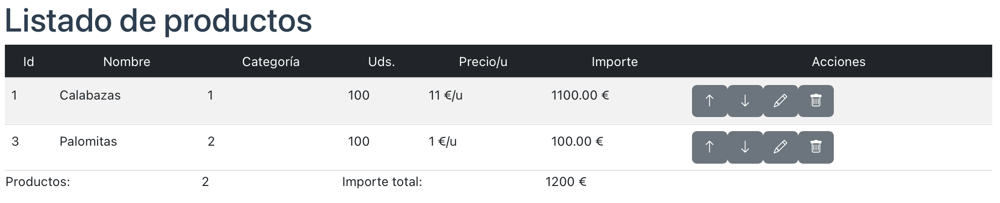

# Proyecto Final VUE

## 1. Aplicación base

Vamos a hacer en Vue una aplicación de gestión de un almacén con productos. 

Como API para almacenar los datos usaremos json-server. Deberéis instalarlo y configurarlo correctamente para poder acceder a él. También, dentro del proyecto necesitaremos instalar  la librería **axios** y para la apariencia usaremos también **bootstrap** y sus iconos.

En nuestra App.vue tendremos como mínimo los siguientes componentes:

- AppMenu: menú de la aplicación (no es funcional y se suministra) 
- ProductsTable: la tabla de productos (cada producto será un subcomponente)
- ProductItem: Contendrá cada producto y los botones de acción sobre cada producto.
- ProductForm: el formulario para añadir productos

El aspecto de la aplicación será la siguiente:


Nuestra aplicación debe pedir los datos al servidor y mostrarlos en la tabla. Bajo la tabla se muestra el total de productos listados y el importe total de los mismos (usaremos variables **computed**).

También será funcional el formulario (aunque no lo validaremos mas que en el HTML). El formulario tendrá unos botones de borrar producto y aumentar y disminuir unidades. 

Antes de borrar un producto pediremos confirmación al usuario en la que le indicaremos el nombre del producto que se va a borrar. Estos botones ( y el formulario) deberán modificar los datos en la BBDD.

El resultado será algo como esto:




Respecto a los datos extraidos de la base de datos, los guardaremos en un array que gestionaremos con un **Store pattern**.

IMPORTANTE: recuerda que en un *store pattern* no podemos cambiar por otra la variable que contiene los datos. Por ejemplo para un método de cargar productos no puede hacerse algo como

```
loadProductsAction (products) {
 this.state.products = products;
}
```

ni si queremos borrarlos todos podemos hacer

```
clearProductsAction () {
 this.state.products = [];
}
```

porque entonces la variable *products* dejaría de ser reactiva (la estamos machacando). Debemos usar métodos que no modifiquen la variable original, como *push*, *splice*, ...

## 2. Recursos

Se suministra el siguiente código para que lo podáis utilizar y tener la base del proyecto:

### App.vue

```vue
<script>
import AppMenu from './components/AppMenu.vue';
import ProductForm from './components/ProductForm.vue';
import ProductsTable from './components/ProductsTable.vue';

import { store } from './store/data'

export default {
  components: { ProductsTable, ProductForm, AppMenu },
  data() {
        return {
            products: store.products,
            categories: store.categories,
        };
    },
    mounted() {
      store.loadData()
    },
}
</script>

<template>
  <div class="container">
    <AppMenu></AppMenu>
    <ProductsTable></ProductsTable>
    <ProductForm></ProductForm>
    <footer><small>Diseño Web en Entorno Cliente - IES Mestre Ramon Esteve</small></footer>
  </div>
</template>
```

### AppMenu.vue

```vue
<template>
    <nav class="navbar navbar-expand-lg navbar-dark bg-dark">
    <div class="container-fluid">
        <span class="navbar-brand" href="#">Almacén IESMRE</span>
        <div class="collapse navbar-collapse" id="navbarNavAltMarkup">
            <div class="navbar-nav">
                <a class="nav-link active" data-div="div-prods" aria-current="page" href="#">Productos</a>
                <a class="nav-link" data-div="div-cats" href="#">Categorías</a>
                <a class="nav-link" data-div="div-form-prod" href="#">Añadir producto</a>
                <a class="nav-link" data-div="div-form-cat" href="#">Añadir categoría</a>
                <a class="nav-link" data-div="div-about" href="#">Sobre nosotros</a>
            </div>
        </div>
    </div>
</nav>
</template>

<script>
export default {

}
</script>
```

### Template ProductForm.vue

```vue
<template>
    <div class="row">
        <div class="col-sm-12 col-md-8 col-lg-8">
            <form @submit.prevent="submitForm">
                <fieldset>
                    <legend class="bg-dark text-white text-center">Añadir producto</legend>
                    <!-- Aquí los inputs y botones del form -->
                    <div class="form-group">
                        <label for="newprod-id">ID:</label>
                        <input type="text" v-model="product.id" class="form-control" disabled>
                    </div>
                    <div class="form-group">
                        <label for="newprod-name">Nombre:</label>
                        <input type="text" v-model="product.name" class="form-control" required>
                        <span class="error"></span>
                    </div>
                    <div class="form-group">
                        <label for="newprod-cat">Categoría:</label>
                        <select v-model="product.category" class="form-control" required>
                            <option value="">--- Selecciona categoría ---</option>
                            <option 
                                v-for="cat in categories" :key="cat.id"
                                :value="cat.id"
                                :title="cat.description"
                            >{{ cat.name}}</option>
                        </select>
                        <span class="error"></span>
                    </div>

                    <div class="form-group">
                        <label for="newprod-units">Unidades.:</label>
                        <input type="number" v-model="product.units" class="form-control" min="0" step="1">
                        <span class="error"></span>
                    </div>
                    <div class="form-group">
                        <label for="newprod-price">Precio/u.:</label>
                        <input type="number" v-model="product.price" class="form-control" required min="0" step="0.01">
                        <span class="error"></span>
                    </div>
                    <br>
                    <button type="submit" class="btn btn-default btn-dark">Añadir</button>
                    <button type="reset" class="btn btn-danger">Reset</button>
                </fieldset>
            </form>
        </div>
    </div>
</template>
```

### style ProductItem.vue

```vue
<style scoped>
@import url("https://cdn.jsdelivr.net/npm/bootstrap-icons@1.10.2/font/bootstrap-icons.css");
</style>
```

