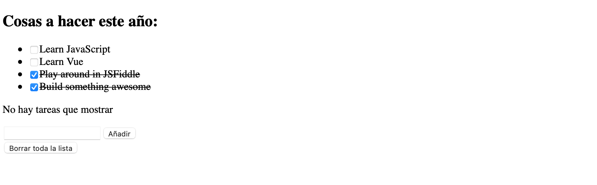

# Actividades Repaso UD 09
## Ejercicio 1 - Lista de tareas
Vamos a hacer una aplicación para gestionar una lista de cosas a hacer. Cada cosa a hacer tiene un título y puede estar hecha o no.

Debe aparecer la lista de cosas a hacer con:

1. Un checkbox para cada cosa que nos indica si está o no hecha (y que podemos marcar/desmarcar para cambiar su estado)
2. El título de la cosa a hacer, que aparecerá tachado si su estado es que ya está hecha
   Además queremos que:
   - Al hacer doble click en una cosa a hacer debe borrarse de la lista bajo la lista aparecerá un input con un botón para añadir nuevas cosas a la lista. 
   - Sólo se añade si hemos introducido texto y su estado al añadirla será de NO hecha
     debajo tendremos un botón que borrará toda la lista de cosas a hacer tras pedir confirmación al usuario

Quedaría más o menos de esta forma:

