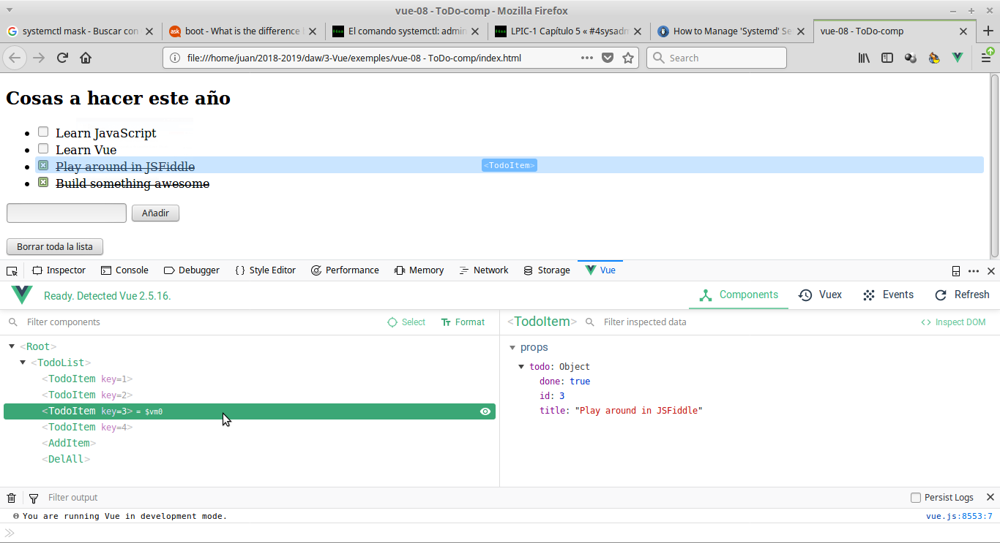
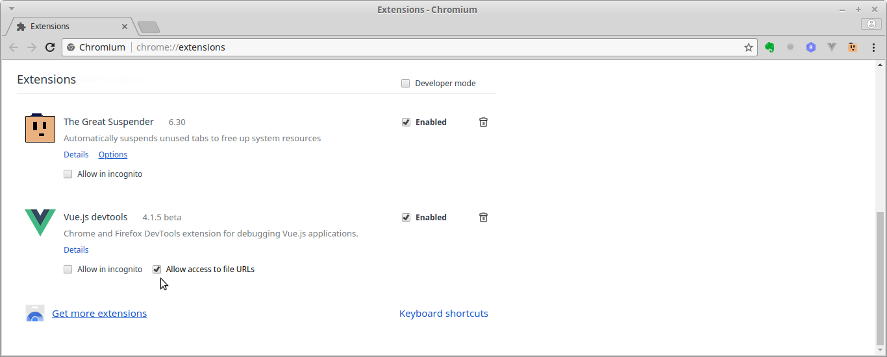

# UD09 - Introducción y elementos básicos en Vue
[TOC]

## 1. Introducción
El uso de un framework nos facilita enormemente el trabajo a la hora de crear una aplicación. Vue es un framework progresivo para la construcción de interfaces de usuario y aplicaciones desde el lado del cliente. Lo de framework "progresivo" significa que su núcleo es pequeño pero está diseñado para crecer: su núcleo está enfocado sólo en la capa de visualización pero es fácil añadirle otras bibliotecas o proyectos existentes (algunos desarrollados por el mismo equipo de Vue) que nos permitan crear complejas SPA.

Su código es _opensource_ y fue creado por el desarrollador independiente [Evan You](https://evanyou.me/), lo que lo diferencia de los otros 2 frameworks más utilizados, _Angular_ desarrollado por Google y _React_ desarrollado por Facebook.

Vue tiene una curva de aprendizaje menor que otros frameworks y es extremadamente rápido y ligero.

Este material está basado en la [guía oficial de Vue](https://vuejs.org/guide/introduction.html) y veremos además los servicios de vue-router, axios y pinia (sustituto de vuex en Vue3) entre otros.

**¿Qué framework es mejor?**
Depende de la aplicación a desarrollar y de los gustos del programador. Tenéis algunos enlaces al respecto:
* [Comparativa VueJs](https://vuejs.org/v2/guide/comparison.html)
* [Comparativa Openwebminars](https://openwebinars.net/blog/los-6-mejores-frameworks-javascript/?utm_source=customer-io&utm_medium=newsletter)
* [Openwebminars: Vue vs Angular](https://openwebinars.net/blog/vue-vs-angular/)
* [Carlos Azaustre: Vue vs Angular (vídeo)](https://www.youtube.com/watch?v=jTtab_rnvic)
* [Angular vs React vs Vue: Which Framework to Choose in 2021](https://www.codeinwp.com/blog/angular-vs-vue-vs-react/)
* ...

Las razones de que veamos Vue en vez de Angular o React son, en resumen:
* **Sencillez**: aunque Angular es el framework más demandado hoy en el mercado su curva de aprendizaje es muy pronunciada. Vue es mucho más sencillo de aprender pero su forma de trabajar es muy similar a Angular por lo que el paso desde Vue a Angular es relativamente sencillo
* **Uso del framework**: React es también muy sencillo ya que es simplemente Javascript en el que podemos codificar la vista con JSX, pero la forma de trabajar de Vue es más parecida a otros frameworks, especialmente a Angular por lo que lo aprendido nos será de gran ayuda si queremos pasar a ese framework
* **Rendimiento**: Vue hace uso del concepto de _Virtual DOM_ igual que React por lo que también ofrece muy buen rendimiento

## 2. Usar Vue
Para utilizar Vue sólo necesitamos enlazarlo en nuestra página desde un CDN. Si queremos usar la nueva versión Vue 3 usaremos cualquier CDN como:
```html
<script src="https://unpkg.com/vue@next"></script>

<script src="https://unpkg.com/vue@3.2.21/dist/vue.global.prod.js"></script>

<script src="https://cdnjs.cloudflare.com/ajax/libs/vue/3.2.21/vue.cjs.js" integrity="sha512-2e2aXOh4/FgkCAUyurkjk0Uw4m1gPcExFwb1Ai4Ajjg97se/FEWfrLG1na4mq8cgOzouc8qLIqsh0EGksPGdqQ==" crossorigin="anonymous" referrerpolicy="no-referrer"></script>
```

Esta no es la forma más recomendable de trabajar por lo que más adelante usaremos la herramienta `vue-cli` para crear un completo _scaffolding_ que nos facilitará enormemente la creación de nuestras aplicaciones (donde podremos incluir otras herramientas, trabajar con componentes o construir una SPA de forma sencilla).

Nosotros estamos usando _VSCode_ como editor. Para que reconozca correctamente los ficheros _.vue_ debemos instalar el _plugin_ **Vetur**. Si vamos a usar Vue3 con Typescript podemos instalar el _plugin_ **Volar**.

## 3. Estructura de una aplicación Vue
Vamos a crear la aplicación con Vue que mostrará un saludo. En el HTML necesitamos enlazar la librería de Vue y creamos un elemento (en nuestro caso un DIV) que contendrá la aplicación. En Vue 3:

```html
<div id="app">
  {{ message }}
</div>

<footer>
  <p>
    <span class="copy-left">©</span>
    <span>DWEC - Vue3</span>
  </p>
</footer>

<script src="https://unpkg.com/vue@next"></script>
```


```javascript
Vue.createApp({
  data() {
    return {
      message: 'Hello Vue.js!'
    }
  }
}).mount('#app');

```

### 3.1 HTML
En el HTML debemos vincular los scripts de la librería de Vue y de nuestro código. 

Vue se ejecutará dentro de un elemento de nuestra página (al que se le suele poner como id _app_) que en este caso es un `<div>`.

Dentro de ese elemento es donde podemos usar expresiones de Vue (fuera del mismo se ignorarán). En este ejemplo se usa el _moustache_ ( **{\{ ... }}** ) que muestra en la página la variable o expresión Javascript que contiene.

### 3.2 Javascript
En el fichero JS debemos crear un nuevo objeto Vue que recibe como parámetro un objeto con varias propiedades.

En **Vue 3** la sintaxis para crear la aplicación es ligeramente diferente:
```javascript
var app = Vue.createApp({
  data() {
    return {
      message: 'Hello Vue!'
    }
  }
})
app.mount('#app')
```

Las principales diferencias son:
- la instancia se crea con el método _`createApp`_ en vez de con el constructor de Vue
- el elemento en que se montará la aplicación no se incluye como una propiedad del objeto que se pasa al crear la aplicación sino que se indica en el método _`mount`_
- la propiedad _data_ no es un objeto sino una función que devuelve ese objeto (esto sucede igual en los componentes de Vue2 como veremos más adelante).

## 4. La instancia _Vue_
La instancia que hemos creado (al igual que cada componente) recibe un objeto de opciones con las siguientes propiedades:
* **data**: objeto (o función) donde definiremos todas las variables que vamos a usar en la vista. Las variables que sólo se usan en javascript las definiremos con **let** en el método donde vayamos a usarlas. Todas las variables definidas en _data_ son accesibles desde la vista poniendo **{\{ su_nombre }}** y desde el código JS poniendo **`this.su_nombre`**
* **computed**: son variables cuyo valor hay que calcularlo usando una función. Por ejemplo:

```javascript
data: {
    nombre: 'David',
    apellido: 'Espert', 
},
computed: {
    nombreCompleto() {
        return this.nombre + ' ' + this.apellido;
    }
}
```

* **methods**: objeto con métodos que también podemos llamar desde la vista
* **_hooks_** (eventos del ciclo de vida de la instancia): para ejecutar código en determinados momentos: **'created'**, **'mounted'**, **'updated'**, **'destroyed'**. Ej.:

```javascript
created() {
    console.log('instancia creada'); 
}
```

## 5. _Binding_ de variables
En la [Guía de la documentación oficial de Vue](https://vuejs.org/tutorial/#step-1) tenemos un tutorial guiado donde podemos probar cada una de las funcionalidades de Vue. En la parte superior izquierda nos pregunta por nuestras preferencias: de momento escogeremos **Options** y **HTML**.

Para probar el funcionamiento de los ejemplos de este tutorial conviene que nos descarguemos los ficheros y los abramos en local.

Fichero HTML:
```html
<!DOCTYPE html>
<html>
<head>
  <title>Hello world</title>
</head>
<body>

  <div id="app">
    <p>{ { message }}</p>
  </div>

  <script src="https://unpkg.com/vue"></script>
  <script src="01-HelloWorld.js"></script>
</body>
</html>
```
Nuestro código debemos cargarlo después de cargar la librería y de crear el elemento HTML que contenga la aplicación.

Fichero JS en Vue3:
```javascript
var miApp = Vue.createApp({
  data() {
    return {
      message: 'Hello Vue.js!'
    }
  }
}).mount('#app');
```

### 5.1 Enlace unidireccional: interpolación {\{...}}
Hemos creado una variable _miApp_ que contiene nuestro objeto Vue y que podemos ver y manipular desde la consola. Si cambiamos el valor de la variable _message_

```javascript
miApp.message = "Hola Vue!";
```

vemos que cambia lo que muestra nuestra página.

Esto es porque Vue (al igual que Angular o React) enlazan el DOM y los datos de forma que cualquier cambio en uno se refleja automáticamente en el otro.

### 5.2 Enlazar a un atributo: v-bind
Para mostrar un dato en el DOM usamos la interpolación **{\{  }}** pero si queremos nostrarlo como atributo de una etiqueta debemos usar `v-bind`:
```html
  <p v-bind:title="message">
    Hover your mouse over me for a few seconds
    to see my dynamically bound title!
  </p>
```

Vue incorpora estos '_atributos_' que podemos usar en las etiquetas HTML y que se llaman **directivas**. Todas las directivas comienzan por **`v-`** (en Angular es igual pero el prefijo es _ng-_). Como la directiva `v-bind` se utiliza mucho se puede abreviar símplemente como `:` (el carácter 'dos puntos'). El siguiente código es equivalente al de antes:
```html
  <p :title="message">
```

### 5.3 Enlace bidireccional: v-model
Tanto **{\{ }}** como `v-bind` son un enlace unidireccional: muestran en el DOM el valor de un dato y reaccionan ante cualquier cambio en dicho valor. 

Tenemos además está la directiva `v-model` que es un enlace bidireccional que enlaza un dato a un campo de formulario y permite cambiar el valor del campo al cambiar el dato pero también cambia el dato si se modifica lo introducido en el input. 
```html
  <input v-model="message">
```

Fichero HTML:

```html
<div id="app">
  <p>El valor actual de la variable 'message' es <strong>{{ message }}</strong></p>
  <label>Si cambias el valor del input se cambia la variable:</label>
  <input v-model="message">
</div>

<footer>
  <p>
    <span class="copy-left">©</span>
    <span>DWC - Vue JS</span>
  </p>
</footer>
<script src="https://unpkg.com/vue@next"></script>
```

Fichero JS en Vue3:

```javascript
var miApp = Vue.createApp({
  data() {
    return {
      message: 'Hello Vue.js!'
    }
  }
}).mount('#app');
```

Vemos que al escribir en el _input_ automáticamente cambia lo mostrado en el primer párrafo. Esta característica nos permite ahorrar innumerables líneas de código para hacer que el DOM refleje los cambios que se producen en los datos.

NOTA: toda la aplicación se monta en el elemento _app_ por lo que las directivas o interpolaciones que pongamos fuera del mismo no se interpretarán.

## 6. Otras utilidades

### 6.1 [Vue devtools]

Es una extensión para Chrome y Firefox que nos permite inspeccionar nuestro objeto Vue y acceder a todos los datos de nuestra aplicación. Es necesario instalarlo porque nos ayudará mucho a depurar nuestra aplicación, especialmente cuando comencemos a usar componentes.

Podemos buscar la extensión en nuestro navegador o acceder al enlace desde la [documentación de Vue](https://vuejs.org/guide/scaling-up/tooling.html#browser-devtools).

Si tenemos las DevTools instaladas en la herramienta de desarrollador aparece una nueva opción, _Vue_, con 4 botones:
* Componentes: es la vista por defecto y nos permite inspeccionar todos los componentes Vue creados (ahora tenemos sólo 1, el principal, pero más adelante haremos componentes hijos)
* Pinia/Vuex: es la herramienta de gestión de estado para aplicaciones medias/grandes
* Eventos: permite ver todos los eventos emitidos
* Refrescar: refresca la herramienta



Junto al componente que estamos inspeccionando aparece **= $vm0** que indica que DevTools ha creado una variable con ese nombre que contiene el componente por si queremos inspeccionarlo desde la consola.

Cuando inspeccionamos nuestros componentes, bajo la barra de botones aparece otra barra con 3 herramientas:
* Buscar: permite buscar el componente con el nombre introducido aquí
* Seleccionar componente en la página: al pulsarlo (se dibuja un punto en su interior) hace que al pulsar sobre un componente en nuestra página se seleccione en la herramienta de inspeccionar componentes
* Formatear nombre de componentes: muestra los nombres de componentes en el modo _camelCase_ o _kebab-case_

NOTA: Si por algún motivo queremos trabajar sin servidor web (desde file://...) hay que habilitar el acceso a ficheros en la extensión.



### 6.2 Extensiones para el editor de código
Cuando empecemos a trabajar con componentes usaremos ficheros con extensión **.vue** que integran el HTML, el JS y el CSS de cada componente. Para que nuestro editor los detecte correctamente es conveniente instalar la extensión para Vue.

En el caso de _Visual Studio Code_ esta extensión se llama **Volar** (sustituye en _Vue 3_ a la extensión **Vetur** que se usa con _Vue 2_). En _Sublime Text_ tenemos el plugin **Vue Syntax Highlight**.

### 6.3 Otras utilidades
_Vue 3_ permite utilizar directamente _Typescript_ en nuestros componentes simplemente indicándolo al definir el SFC (lo veremos al llegar allí).

Respecto a los _tests_ se recomienda usar _Jest_ para los test unitarios y _Cypress_ para los E2E, como se indica en la [documentación oficial](https://vuejs.org/guide/scaling-up/tooling.html#testing).

### 6.4 Cursos de Vue
Podem trobar molts cursos en internet, alguns 'ells gratuïts. Per exemple els creadors de Vue tenen la web [Vue Mastery](https://www.vuemastery.com) on podem trobar des de cursos d'iniciació (gratuïts) fins els més avançats.